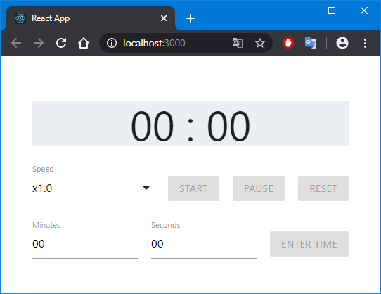
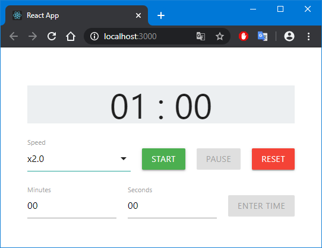
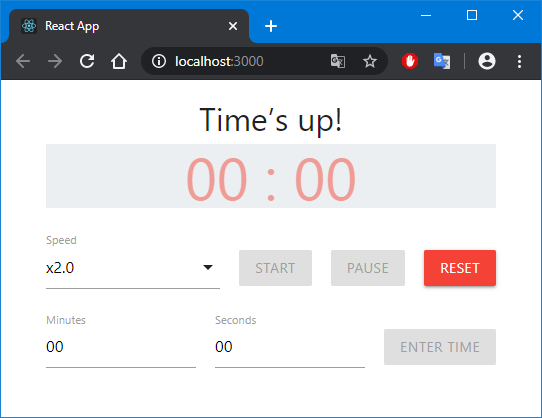

## Countdown Timer SPA

### Problem

Build a countdown timer SPA in a framework library of your choosing (ie - React, Angular, Vue.js) with controls to add time, speed up / slow down the countdown, pause and resume.

### Requirements

* The user should be able to enter a # of minutes (positive integer) and click a “Start” button to initialize the countdown.
* Timer format: MM:SS.
* The user should be able to pause & resume the countdown using pause/resume buttons.
* While the countdown timer is active, the user should be able to speed up / slow down the speed at the following rates:
  - 1.0X (normal speed, selected by default)
  - 1.5X
  - 2X
* When half of the selected duration has been passed, display a string of text above the countdown timer reading: “More than halfway there!”:
  - When the countdown timer reaches 0, this text should change to: “Time’s up!”
* When the countdown is within 20 seconds of ending, the countdown timer text should turn red.
* At 10 seconds, the text should start blinking.
* Include unit testing for applicable functionality.
* The countdown timer functionality should be appropriately divided into well-defined components in accordance with the best practices of the framework/library of your choosing.
* The look of the countdown timer should have a production-ready clean/modern aesthetic. Feel free to creatively stylize the elements.
* Include screenshots in a README.md file.
* Once complete, export your project as a .zip of git repository and submit to either your contact at PullRequest or your interviewer:
  - A link to a publicly available repository on GitHub will work as well.

---

### In this app was used:

* `create-react-app` for deployment of the working environment.
* `materialize-css` for styles.
* `jest` and `enzyme` for tests (not all functionality is covered by tests).

### Runs this app in development mode:

1. `npm install` or `yarn install`: installs all the dependencies defined in a package.json file.
2. `npm start` or `yarn start`: runs the app in development mode.
3.  Open http://localhost:3000 to view it in the browser.
4. `npm test` or `yarn test`: runs the test watcher in an interactive mode.

### Screenshots:

